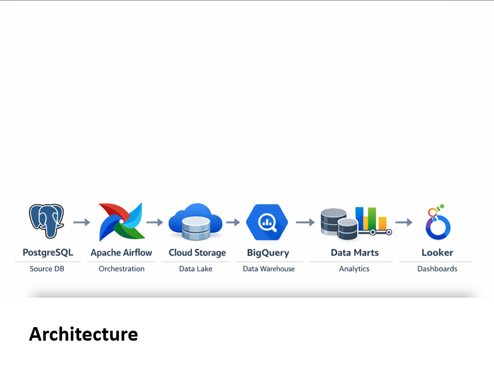

# Retail-Solution-Analytics
End-to-end cloud data pipeline for retail analytics with Airflow orchestration, BigQuery data warehouse, and Looker dashboards.

The pipeline extracts sales data from a PostgreSQL database, orchestrates workflows with Apache Airflow, stores raw data in Google Cloud Storage, transforms it into a dimensional warehouse in BigQuery, and exposes insights through Looker dashboards.

The orchestration environment runs locally using Docker containers.

Architecture:
The project follows a modern cloud data platform architecture including a data lake, dimensional data warehouse, and analytics data marts.

Technologies used:
PostgreSQL – transactional source system
Apache Airflow – pipeline orchestration
Google Cloud Storage – raw data lake
Google BigQuery – analytical warehouse
Looker – analytics dashboards
Docker – containerized execution

Data Pipeline Overview:
The pipeline processes retail transaction data through several layers.

Source Layer:
Transactional sales data is stored in PostgreSQL.
Each row represents a product within an order.

Orchestration:
Airflow DAGs automate the complete pipeline including ingestion, transformations, and data quality checks.

Data Lake:
Raw data extracted from PostgreSQL is stored in Google Cloud Storage as CSV files.
This layer preserves the raw dataset and decouples the source system from the warehouse.

Data Warehouse:
Data is loaded into BigQuery where transformations create a dimensional model.

The warehouse follows a star schema design including:
Fact table:
fact_sales

Dimension tables:
dim_customer
dim_product
dim_date

Data Marts:
Analytics-ready tables are built for business use cases such as:
-executive performance tracking
-product performance analysis

Visualization:
Looker dashboards provide interactive analytics including:
-sales KPIs
-top-performing products
-profitability analysis
-category trends

Project Structure
retail-data-pipeline
│
├── dags
│   ├── sales_master_pipeline.py
│   ├── sales_pipeline_raw.py
│   ├── sales_pipeline_core.py
│   ├── sales_pipeline_marts.py
│   └── data_quality_checks.py
│
├── sql
│   ├── raw
│   ├── core
│   ├── marts
│   └── quality
│
├── architecture
│   └── architecture.png
│
├── screenshots
│   ├── airflow_pipeline.png
│   ├── cloud_storage_bucket.png
│   ├── bigquery_schema.png
│   ├── looker_dashboard_executive.png
│   └── looker_dashboard_product.png
│
└── README.md

Pipeline Orchestration
The pipeline is controlled by a master Airflow DAG that triggers several sub-pipelines.
sales_master_pipeline

This master pipeline orchestrates:
-sales_pipeline_raw
-sales_pipeline_core
-sales_pipeline_marts
-data_quality_checks

Each pipeline represents a logical stage of the data platform.

Running the Project
The orchestration environment is containerized.

Start the system using Docker Compose:
docker compose up
This launches the Airflow services and supporting containers.

The Airflow UI is available at:
http://localhost:8080

From the interface you can trigger the master pipeline.
Example Pipeline Execution
Below are examples of the system in operation.

Airflow DAG execution

BigQuery warehouse schema
Looker dashboards

Key Skills Demonstrated:
Data Engineering:
ETL / ELT pipeline design
workflow orchestration
SQL transformations
dimensional modeling (star schema)

Cloud Analytics:
data lake architecture
cloud data warehouse design
analytics data marts

Platform Engineering:
containerized environments
pipeline automation
data quality validation

Possible Extensions:
Future improvements could include:
real-time ingestion pipelines
streaming analytics
CI/CD pipeline deployment
machine learning models on warehouse data
